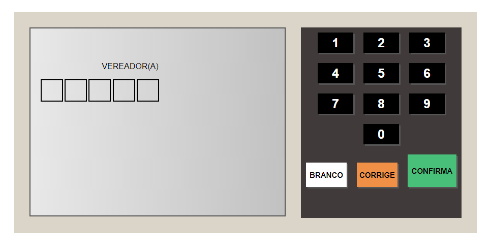
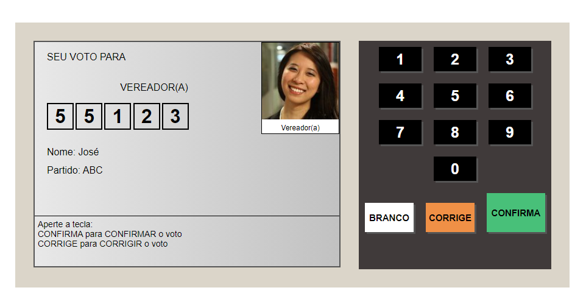
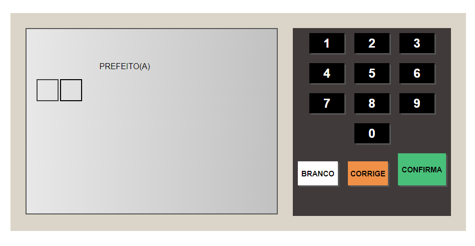
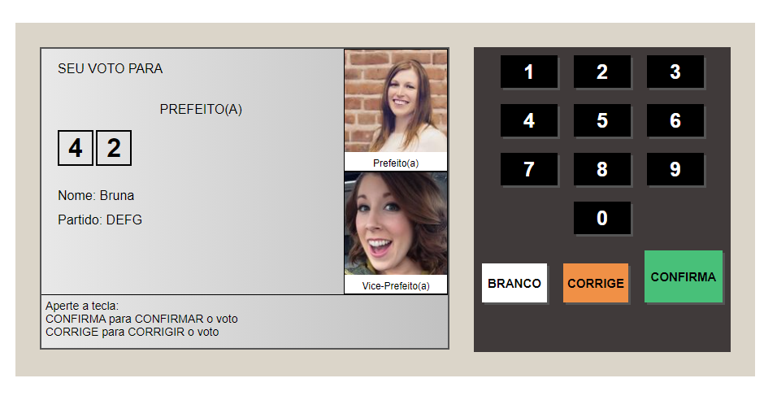
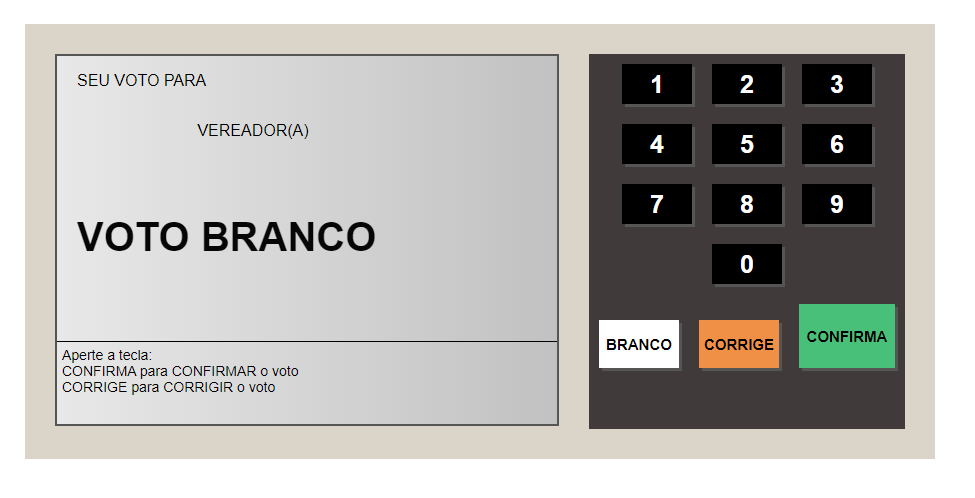
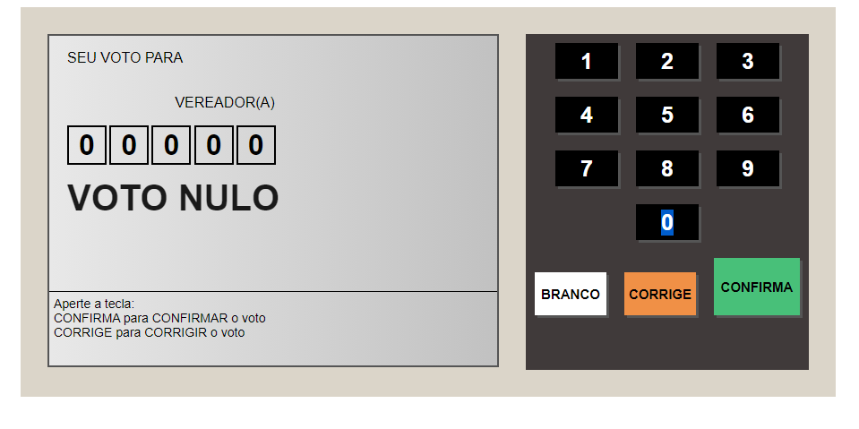

# urna_eletronica
Esse projeto utilaza JavaScript para simular uma urna eletrônica, na eleições para prefeitos e vereadores 

## Minha aplicação:

## Sobre a aplicação:

Esse projeto extrai dados de um objeto de um arquivo JSON e por meio dele, montamos o layout da urna e o fluxo para
simular o processo eleitoral para escolha de prefeitos e vereadores, esse sistema possui também as funcionalidades de voto
branco e nulo, além disso ele possui as funções de confirmar e corrigir seu voto, sendo assim bem fiel a urna eletrônica. Obviamente não
foi minha intenção adicionar ao projeto nenhuma chave de segurança.

## Por que esse projeto?

Esse projeto foi ensinado em um workshop pela empresa b7web, implementei esse projeto, pois ele possui regras de certa forma um pouco 
complexa sendo uma ótima oportunidade para desenvolver minha lógica de programação e meu portfólio.

Ficaria feliz com feedbacks:

E-mail: rapaheldesousalm@gmail.com
linkdin: https://www.linkedin.com/in/raphaellima98/
